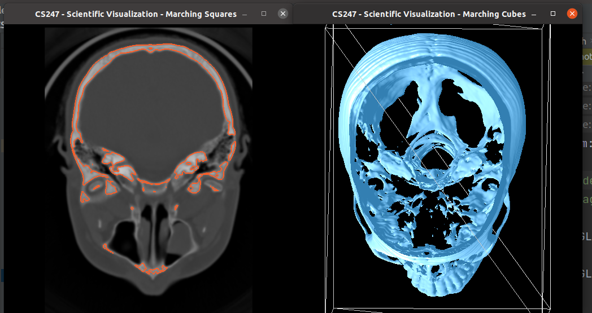

# Assignment 3 Description (9% of total grade) #
**Due: March 15th**

Based on Assignments #1 and #2 the task in this assignment is to create a 3D iso surface renderer in a second window.

## Reading assignments ##
* Data Visualization book, Chapter 5 until 5.3 (inclusive)
* Willaim E. Lorensen, Harvey E. Cline:
Marching cubes: A high resolution 3D surface construction algorithm
SIGGRAPH '87
https://dl.acm.org/citation.cfm?id=37422

## Basic Tasks ##

* Calculate iso-surface using Marching Cubes algorithm. Implement marching cubes, conceptually the extension of 2D marching squares to 3D, to create a surface in the volume data, for a specified iso-value. The surface is generated by creating triangle patches and calculating normals of the surface. For calculating the normal use central differences on the original volume data and interpolate the normals to get the normal at the computed surface points.
* Draw the generated surface in the second window.

### 3D Iso-surface Rendering [100 points] ###
+ Draw the Iso-surface that corresponds to the selected iso-value (25 points)
    * Make sure you don't recalculate everything on each frame. (only calculate the surface when the iso-value changes) (15 points)
  * When drawing the surface triangles, make sure you calculate the exact location by interpolation (15 points)
  * Calculate the normals using central differences and map them by interpolation (15 points)
  * Do gouraud shading using the calculated normals (15 points)
  * The iso value must be editable by the user, updating the views (15 points)

## Bonus ##
* Apply phong shading in fragment shader (+10 points)
* Allow user to change light parameters (e.g., light position) (+10 points)

## Notes ##

* There aren't prototypes for every function you might need. Create functions as you need them.
* We give you the lookup tables for the marching cubes (in the .h file). Indexing of vertices and edges in the lookups is following:

* **You need to be careful what you do in which window,** OpenGL uses contexts, which are not shared between windows in our example. So, for example, when you download a texture with the 2D window active it won't be available for rendering in the 3D window.

## Screenshots for Minimum Requirements Solution ##

